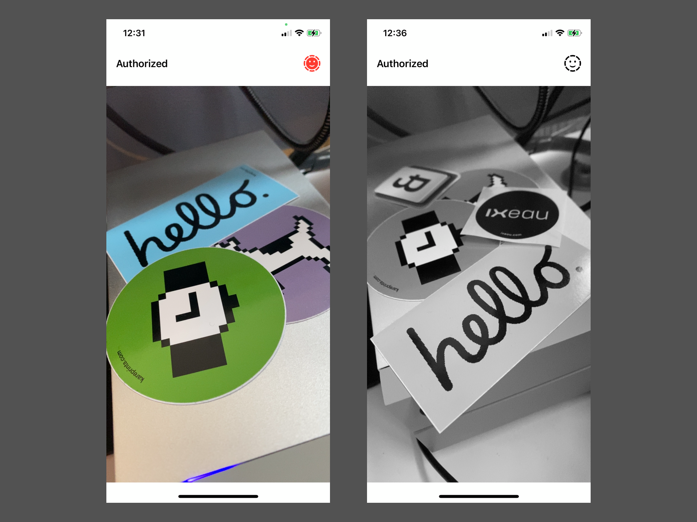

# CameraDemo

SwiftUI based app that shows how to build a custom CameraView based on `UIKit` and `AVFoundation`. Prepared to take photos too!

## 🌀 Support me
I’m Martin, an indie dev from Berlin. If you find my work useful, please consider to support my work! You can find some great apps of mine on the [Mac App Store](https://apps.apple.com/developer/id955848754) 🌀
